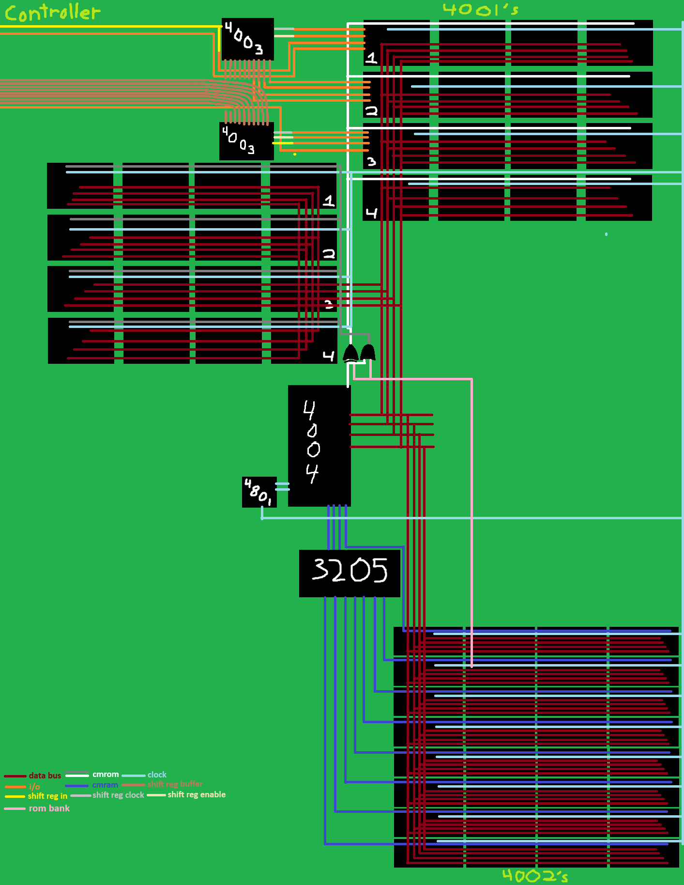

# The Motherboard
The motherboard consists of the following parts:
- CPU: Intel 4004
- ROM: 32 x Intel 4001, banked with RAM Chip 5 I/O0
- RAM: 32 x Intel 4002, banked with 3-to-8 decoder from CM-RAM lines
- Controller: 8-button, controlled from ROM Chip 0 I/O, data sent to ROM Chip 1 I/O
- Display: 8x8 1bpp display, controlled from ROM Chip 2 I/O

Here's a bad drawing of what the motherboard looks like:

[Prev](4_Intel-4002.md) | [Next](6_CPU-Instruction.md)